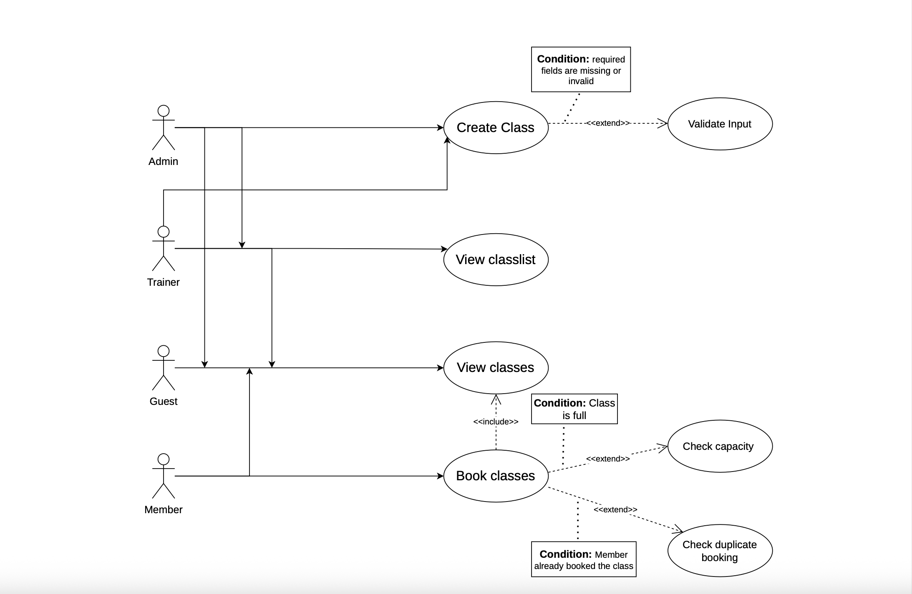

# Requirements Document for Fitness Class Management System

## 1. Requirements Elicitation and Analysis

**Meeting Date:** February 10, 2026

**Elicitation Techniques Used:**
* **Structured Interview / Q&A:** We conducted a direct question-and-answer session with the client to define the scope of Sprint 1. We specifically asked about user roles, authentication requirements, class constraints, and features such as filtering and sorting of classes. This helped clarify what was expected for the current sprint.
* **Constraint Analysis:** We walked through potential features like password recovery, payments, and notifications to determine what was necessary for the current sprint and what should be deferred to future work.
* **Use Cases & UML Diagramming (Post-Meeting):** After the meeting, we created a UML use case diagram and fleshed out detailed use cases for each feature. This visual and written representation helped us better understand each feature and the interactions between users and the system.

**Reflections:**
1. **Utility of Techniques:** The structured interview was highly effective for establishing strict boundaries for the project. By asking specific questions about features like password verification and payment systems, we were able to eliminate unnecessary work and focus purely on the core booking and class management logic.
2. **Important Clarification Gained:** A critical clarification gained was regarding class scheduling and capacity. We learned that while class times are permitted to overlap, the trainer must have the authority to set a specific capacity limit for each session.

## 2. Requirements Specification

### 2.1 Use Case Diagram





### 2.2 Use Cases

---


## Use Case 1: Create Class

**Actor:** Admin / Trainer  

**Preconditions:** Actor is logged in with role `Admin` or `Trainer`  

**Endpoint:** `POST /classes`  

**Input:** JSON object with the following fields:

```json
{
  "title": "Yoga",
  "venue": "Studio 1",
  "capacity": 10,
  "date": "2026-02-20",
  "start_time": "10:00",
  "end_time": "11:00"
}
````

**Main Success Scenario:**

1. Actor sends a request with class details to the endpoint.
2. System validates all required fields and checks that `capacity > 0`.
3. System creates a new class and assigns it a unique ID.
4. System returns a confirmation message with the newly created class.

**Alternative Flows:**

* Missing required fields → returns `400 Bad Request` with an error message.
* Invalid capacity (not a number or ≤ 0) → returns `400 Bad Request`.
* Unauthorized role → returns `403 Forbidden`.

**Postconditions:**

* The class is added to the system and is available for booking by members.

---

## Use Case 2: View Class List

**Actor:** Admin / Trainer / Member / Guest

**Preconditions:** None

**Endpoint:** `GET /classes`

**Main Success Scenario:**

1. Actor requests the list of all upcoming classes.
2. System retrieves all classes with details (`title`, `venue`, `capacity`, `date`, `start_time`, `end_time`).
3. System returns the list in JSON format.

**Alternative Flows:**

* No classes exist → returns message: `"No classes available"` with `200 OK`.

**Postconditions:**

* Actor can see all upcoming classes.

---

## Use Case 3: Book Class

**Actor:** Member

**Preconditions:** Actor is logged in with role `Member`

**Endpoint:** `POST /classes/<class_id>/book`

**Input:** Header must contain `User` (member name)

**Main Success Scenario:**

1. Member selects a class to book.
2. System checks that the class exists.
3. System verifies that class capacity is not exceeded and that the member has not already booked.
4. System adds the member to the class booking list.
5. System returns a confirmation message: `"Booking successful."`

**Alternative Flows:**

* Class full → returns `400 Bad Request` with message `"Class is full."`
* Member already booked → returns `400 Bad Request` with message `"Member already booked this class."`
* Class not found → returns `404 Not Found`.
* Unauthorized role → returns `403 Forbidden`.

**Postconditions:**

* Member is booked into the class and class capacity is updated.

---

## Use Case 4: View Members of a Class

**Actor:** Admin / Trainer

**Preconditions:** Actor is logged in with role `Admin` or `Trainer`

**Endpoint:** `GET /classes/<class_id>/members`

**Main Success Scenario:**

1. Actor requests the list of members booked for a specific class.
2. System retrieves all booked members for the class.
3. System returns the list in JSON format.

**Alternative Flows:**

* No members booked → returns message: `"No members have booked this class yet."`
* Class not found → returns `404 Not Found`.
* Unauthorized role → returns `403 Forbidden`.

**Postconditions:**

* Actor can view all members currently booked in the class.

```


